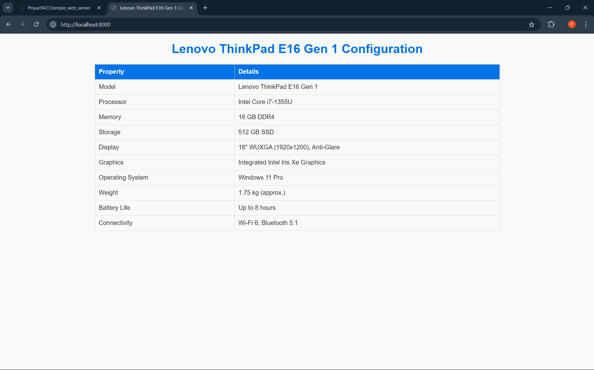
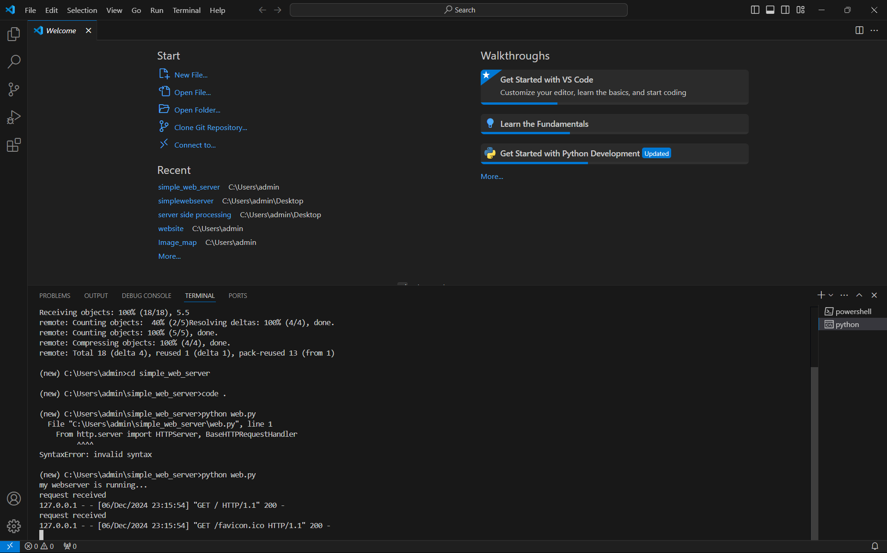

# EX01 Developing a Simple Webserver

# Date:5/10/24
# AIM:
To develop a simple webserver to serve html pages and display the configuration details of laptop.

# DESIGN STEPS:
## Step 1:
HTML content creation.

## Step 2:
Design of webserver workflow.

## Step 3:
Implementation using Python code.

## Step 4:
Serving the HTML pages.

## Step 5:
Testing the webserver.

# PROGRAM:
```
from http.server import HTTPServer, BaseHTTPRequestHandler
content="""
<!DOCTYPE html>
<html lang="en">
<head>
    <meta charset="UTF-8">
    <meta name="viewport" content="width=device-width, initial-scale=1.0">
    <title>Lenovo ThinkPad E16 Gen 1 Configuration</title>
    <style>
        body {
            font-family: Arial, sans-serif;
            margin: 20px;
            background-color: #f8f9fa;
            color: #333;
        }
        h1 {
            text-align: center;
            color: #0073e6;
        }
        table {
            width: 70%;
            margin: 20px auto;
            border-collapse: collapse;
            border: 1px solid #ddd;
        }
        th, td {
            padding: 10px;
            border: 1px solid #ddd;
            text-align: left;
        }
        th {
            background-color: #0073e6;
            color: white;
        }
        tr:nth-child(even) {
            background-color: #f9f9f9;
        }
    </style>
</head>
<body>
    <h1>Lenovo ThinkPad E16 Gen 1 Configuration</h1>
    <table>
        <tr>
            <th>Property</th>
            <th>Details</th>
        </tr>
        <tr>
            <td>Model</td>
            <td>Lenovo ThinkPad E16 Gen 1</td>
        </tr>
        <tr>
            <td>Processor</td>
            <td>Intel Core i7-1355U</td>
        </tr>
        <tr>
            <td>Memory</td>
            <td>16 GB DDR4</td>
        </tr>
        <tr>
            <td>Storage</td>
            <td>512 GB SSD</td>
        </tr>
        <tr>
            <td>Display</td>
            <td>16" WUXGA (1920x1200), Anti-Glare</td>
        </tr>
        <tr>
            <td>Graphics</td>
            <td>Integrated Intel Iris Xe Graphics</td>
        </tr>
        <tr>
            <td>Operating System</td>
            <td>Windows 11 Pro</td>
        </tr>
        <tr>
            <td>Weight</td>
            <td>1.75 kg (approx.)</td>
        </tr>
        <tr>
            <td>Battery Life</td>
            <td>Up to 8 hours</td>
        </tr>
        <tr>
            <td>Connectivity</td>
            <td>Wi-Fi 6, Bluetooth 5.1</td>
        </tr>
    </table>
</body>
</html>
"""
class myhandler (BaseHTTPRequestHandler):
    def do_GET(self):
        print("request received")
        self.send_response(200)
        self.send_header('content-type', 'text/html; charset=utf-8')
        self.end_headers()
        self.wfile.write(content.encode())
server_address = ('',8000)
httpd = HTTPServer (server_address, myhandler)
print("my webserver is running...")
httpd.serve_forever()
```
# OUTPUT:


# RESULT:
The program for implementing simple webserver is executed successfully.
